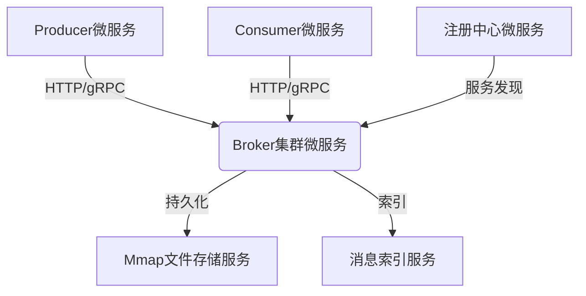

# 🚀 DduoMq：基于微服务架构的自研消息队列系统

## 一、项目概述

DduoMq 是由作者 dduo 基于开发的**微服务架构**消息队列系统 📦。
项目旨在帮助开发者深入理解消息队列核心原理， 参考 RocketMQ、Kafka 等开源消息队列架构思想，以个人学习和技术探索为目标，不仅复现了消息队列关键功能，还通过微服务架构设计提升系统的可扩展性、可维护性和性能，支持多场景消息处理与分布式集群部署 🌟。

## 二、核心功能特性

### 2.1 多样化的消息发送能力 ✉️

**发送模式**：支持同步、异步、单向消息发送，无论是追求低延迟的实时场景，还是高并发的批量处理场景都能轻松应对 ⏱️。

**消息类型**：涵盖普通消息、顺序消息（基于 ShardingKey + 分布式锁实现）、延时消息（通过时间轮调度），满足不同业务的差异化需求 📅。

**批量处理**：支持单批次消息发送与接收，有效提升消息传输效率，减少网络开销 🚀。

### 2.2 灵活的消息消费管理 🎯

**消费模式**：提供 Pull/Push 双模式、集群 / 广播消费模式以及历史消息回溯消费，适配各种复杂的消费场景 🕰️。

**消费控制**：具备消费重试机制、死信队列管理，虽然消费者流量控制还在规划中，但已有的功能足以保障消息消费的稳定性 🔄。

**过滤机制**：支持基于标签与表达式的消息过滤策略，让消费者能够精准获取所需消息 🎣。

### 2.3 高可用与持久化保障 ⚙️

**存储架构**：基于 Mmap+PageCache 实现磁盘持久化，并通过消息索引文件加速检索，在保证数据可靠性的同时提升读写性能 💾。

**集群管理**：采用多主集群架构，结合服务注册与发现（支持 Zookeeper/Nacos）以及 Rebalance 动态负载均衡，确保系统在分布式环境下稳定运行 🌐。

**容错机制**：通过心跳检测、超时重试、死信队列数据隔离等机制，有效应对各种故障情况，提升系统的容错能力 ❤️。

### 2.4 强大的系统扩展能力 🔧

**框架集成**：实现 Spring/Spring Boot 全栈支持，通过简洁的注解即可完成配置，大幅降低使用门槛 🎉。

**注册中心**：不仅支持自研轻量级注册中心，还兼容 Zookeeper、Nacos 等主流注册中心，方便用户根据需求灵活选择 🔌。

**灰度发布**：基于消息分流实现灰度环境无缝过渡，助力业务平滑迭代升级 🔄。

## 三、微服务架构解析 🏗️

DduoMq 采用微服务架构设计，将系统拆分为多个独立的服务，各服务通过轻量级通信机制协同工作，提升系统的可维护性和扩展性。核心组件包括：




**通信层**：基于 Netty 实现高性能 TCP 长连接通信，并支持 HTTP/gRPC 等协议，实现服务间高效通信 📡。

**存储层**：自研文件存储服务，支持消息分段存储与索引，保障数据持久化和快速检索 💽。

**调度层**：时间轮算法实现延时任务高效调度，确保延时消息准确执行 ⏳。

**管理模块**：包含动态 Rebalance、心跳检测、注册中心适配等功能，保障系统稳定运行 🔐。

## 四、快速上手指南 🚀

### 4.1 项目结构说明 📁


```
├── broker          # MQ服务端核心实现（微服务）

│   ├── src         # 服务端代码

│   └── resources   # 配置文件目录

├── client          # MQ客户端库

├── common          # 通用工具类与常量定义

├── example         # 使用示例

│   ├── frameless   # 无框架示例

│   └── spring      # Spring集成示例

├── extension       # 扩展模块

│   ├── spring-boot # Spring Boot Starter

│   ├── nacos       # Nacos注册中心适配

│   └── zookeeper   # Zookeeper注册中心适配

├── registry        # 自研轻量级注册中心（微服务）

└── test            # 测试用例
```

### 4.2 环境部署 🛠️

#### 4.2.1 Broker 部署

构建：进入`broker`目录，执行`mvn clean package`生成可执行 JAR 包 📦。

配置：通过以下优先级指定配置文件

命令行参数：`java -jar broker.jar --spring.config.location=/path/to/config.yml` 🖥️

`application.yaml`中配置`spring.config.location`属性

启动：默认端口配置

客户端通信端口：6086

管理控制台端口：7654（访问`http://localhost:7654`查看队列信息 👀）

#### 4.2.2 注册中心部署

**内置注册中心**：直接启动`registry`模块，默认端口 11111，可快速搭建本地测试环境 🏠。

**第三方注册中心**：替换配置文件中的`registry.type`为`zookeeper`或`nacos`，连接对应注册中心服务 🔗。

### 4.3 客户端使用 📱

#### 4.3.1 Maven 依赖

**无框架依赖**


```
\<dependency>

&#x20;   \<groupId>com.github.dduo\</groupId>

&#x20;   \<artifactId>client\</artifactId>

&#x20;   \<version>0.0.1\</version>

\</dependency>
```

**Spring Boot 集成**


```
\<dependency>

&#x20;   \<groupId>com.github.dduo\</groupId>

&#x20;   \<artifactId>dduomq-spring-boot-starter\</artifactId>

&#x20;   \<version>0.0.1\</version>

\</dependency>
```

#### 4.3.2 示例代码

参考`example`模块中的生产者与消费者示例，通过`@DduoMQProducer`和`@DduoMQConsumer`注解，几行代码即可实现消息生产与消费，简单又便捷 🎉。

## 五、未来优化计划 📝

### 5.1 功能增强 🧰

**事务消息**：实现分布式事务消息处理，保障数据一致性 🔄。

**消息压缩**：支持 Snappy、Zstandard 等压缩算法，减少存储空间和传输带宽 📦。

**ACL 权限控制**：基于角色的访问控制体系，提升系统安全性 🔒。

### 5.2 性能优化 🏎️

**压测分析**：使用 JMeter、Gatling 等工具进行性能基准测试，定位性能瓶颈 ⚙️。

**存储优化**：引入 LSM 树优化写入性能，进一步提升系统吞吐量 💥。

**代码重构**：降低模块耦合度，提升代码的可维护性和可读性 📖。

### 5.3 架构升级 🔝

**主从集群**：实现主从数据同步与故障自动切换，增强系统的高可用性 🆕。

**多租户支持**：隔离不同业务的消息处理资源，满足多租户场景需求 👥。

## 六、联系与反馈 📞

欢迎通过以下方式交流：

**邮箱**：可补充具体邮箱 📧

**GitHub**：可补充项目仓库地址 🌐

提交问题时请包含：

详细操作步骤 📜

完整日志信息 📋

期望结果描述 🎯

DduoMq 基于 CraneMQ 进行开发，在此特别感谢 CraneMQ 项目提供的基础与启发 🙏！期待与各位开发者共同完善 DduoMq，打造更强大的消息队列系统 💪！
